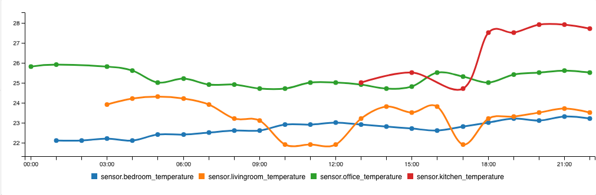

# lovelace-sensor-graphs

I didn´t like the look of the default history-graph card in lovelace, so I started on my own, using C3js.
Note that this is highly Work-In-Progress, and use it at your own risk! :D
And feel free to contribute!

## TO-DO
- Reload graphs when there´s new data
- Add option for other intervals than hourly
- Add styling options
- Add naming options for entities

## Installation

### Step 1

Install `lovelace-sensor-graphs` by copying contents of this repo to `<config>/www/lovelace-sensor-graphs/` of your instance of Home Assistant.

### Step 2

Add the following to your `<config>/ui-lovelace.yaml` file.

```yaml
resources:
  - url: /local/lovelace-sensor-graphs/sensor-graphs.js
    type: js
```

### Step 3

Add a custom element in your `<config>/ui-lovelace.yaml`

```yaml
      - type: "custom:sensor-graphs"
        entities:
          - sensor.bedroom_temperature
          - sensor.livingroom_temperature
```
